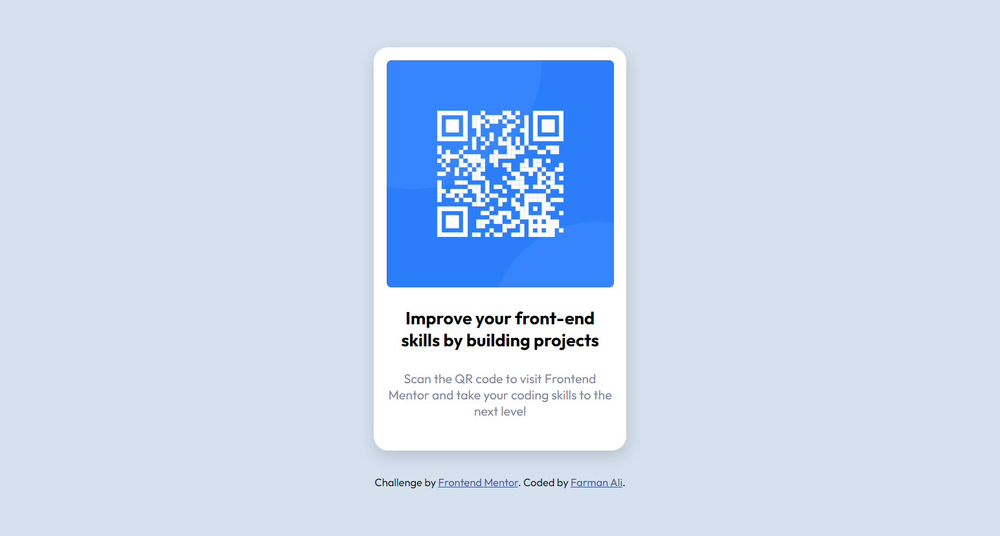
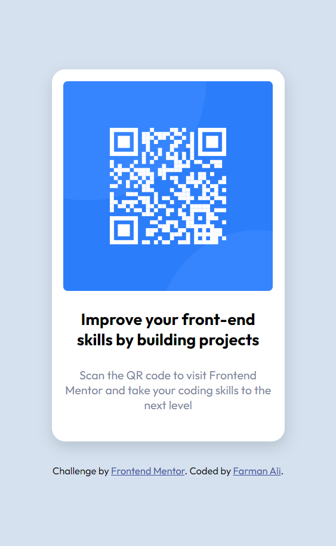

# Frontend Mentor - QR code component solution

This is a solution to the [QR code component challenge on Frontend Mentor](https://www.frontendmentor.io/challenges/qr-code-component-iux_sIO_H). Frontend Mentor challenges help you improve your coding skills by building realistic projects. 

## Table of contents

- [Overview](#overview)
  - [Screenshot](#screenshot)
  - [Links](#links)
- [My process](#my-process)
  - [Built with](#built-with)
  - [What I learned](#what-i-learned)
- [Author](#author)
- [Acknowledgments](#acknowledgments)

**Note: Delete this note and update the table of contents based on what sections you keep.**

## Overview

### Screenshot

### Links

- Solution URL: [Add solution URL here](https://your-solution-url.com)

## My process

### Built with

- Semantic HTML5 markup
- CSS custom properties
- Flexbox

### What I learned

I learned to create a basic design, I created an interactive box of QR code and designed to ask a user to scan that code.

To see how you can add code snippets, see below:

## Author

- Website - [Farman Ali](https://www.linkedin.com/in/farmanali6349/)
- Frontend Mentor - [@farmanali6349](https://www.frontendmentor.io/profile/farmanali6349)
- Twitter - [@farmanali6349](https://www.twitter.com/farmanali6349)

## Acknowledgments

Alhamd o Lillah, I completed my first challenge at frontend mentor.
